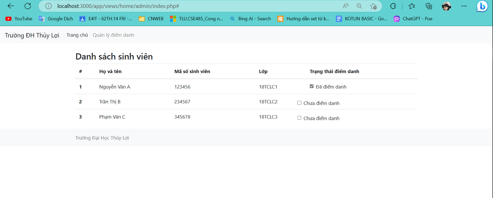

# CSE485_BTTH02
# Mô tả bài toán
- Bài toán Quản lý điểm danh sinh viên đưa ra yêu cầu quản lý thông tin của các sinh viên, khóa học, sự tham dự của sinh viên và giảng viên

# Thực Thể , Mô Hình EER:
1. Mô hình này bao gồm các thực thể chính như sau: 
  1. sinhvien: lưu trữ thông tin về sinh viên bao gồm ID sinh viên, tên, ngày sinh, email và thông tin liên hệ.
  2. khoahoc: lưu trữ thông tin về khóa học bao gồm ID khóa học, mã khóa học, tiêu đề và mô tả.
  3. diemdanh: lưu trữ thông tin về sự tham dự của sinh viên bao gồm ngày, ID lớp học phần, ID sinh viên và trạng thái tham dự.
  4. giangvien: lưu trữ thông tin về giảng viên hoặc người hướng dẫn bao gồm ID giảng viên, tên, email và thông tin liên hệ.
  5. lophocphan: lưu trữ thông tin về các lớp học phần của một khóa học bao gồm ID lớp học phần, ID khóa học, ID giảng viên và khoảng thời gian.
  6. nguoidung : Lưu trữ thông tin về người dùng đăng nhập với tên và mật khẩu đã được cấp gồm ID User, Gmail đăng nhập, Mật Khẩu , ID vai trò
  7. vaitro: Lưu trữ vai trò của người đăng nhập gồm ID vai trò, Tên vai trò 

  ---

 2. Mô hình EER:

  ---
  
 3. ScreenShot:
  |  |  |
  | --- | --- |
  |  |  |

# chức năng
1. Giảng viên đăng nhập và thực hiện quản lý điểm danh
2. Sinh viên đăng nhập và thực hiện điểm danh
